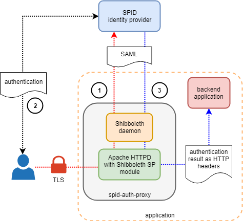

# Example of integration

This is an example of spid-auth-proxy integration. The flow depicted in the
figure describes the interactions amongst the end-user (Alice), the
authentication proxy, the identity provider and the backend application.
In particular

1.  Alice requests to be authenticated and the authentication proxy forwards her
    towards the identity provider

2.  Alice performs the authentication by using one of the authentication
    mechanisms supported by the identity provider (e.g. username/password + OTP)

3.  The authentication proxy forwards the result of the authentication, in form
    of of HTTP headers, to the backend application

## Quick start

1.  Generate a `docker-compose.yml` according to your environment

        $ SERVER_NAME=mytest.example.com envsubst < docker-compose.yml.template > docker-compose.yml

    or

        $ SERVER_NAME=192.168.5.27 envsubst < docker-compose.yml.template > docker-compose.yml

    **Note:** set `SERVER_NAME` to a FQDN if it's already registered on the
    DNS. If not, use an IP address.

2.  Run

        $ docker-compose up --build

3.  In your browser, open the URL

        https://<SERVER_NAME>
